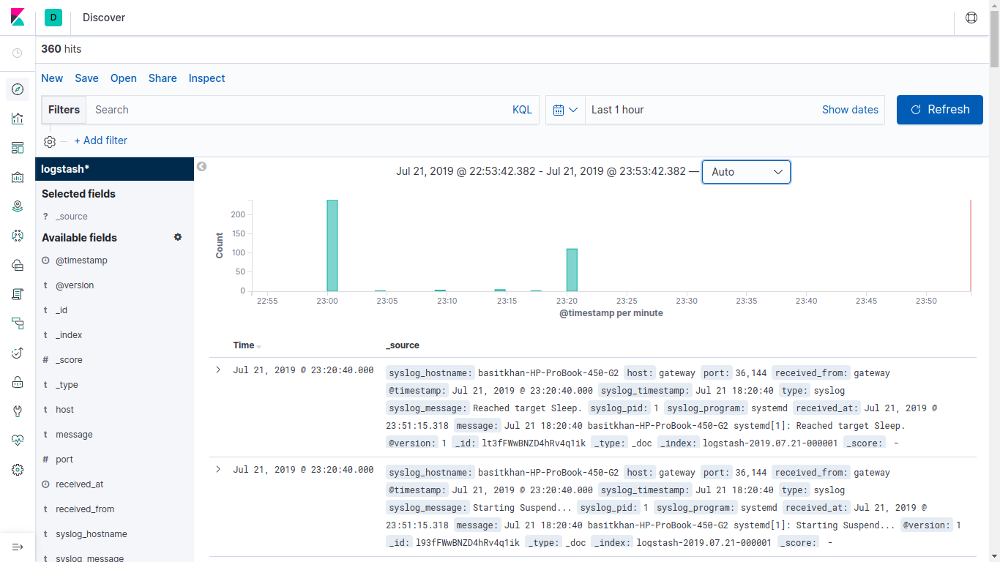
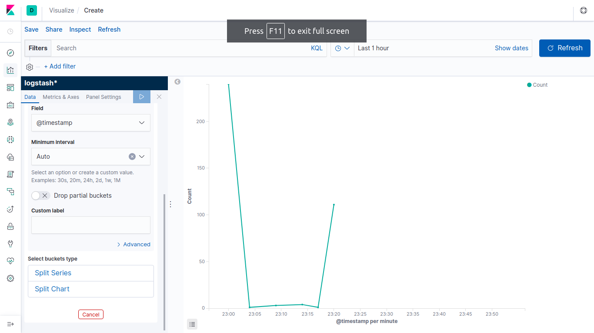
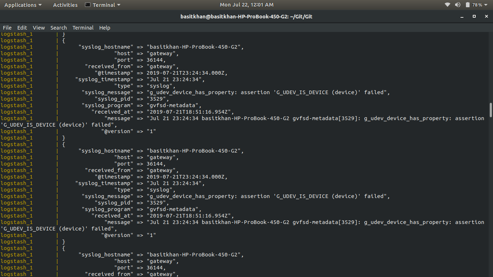

# DOCKER-ELK STACK
Basic ELK stack in Docker for monitoring syslogs

# before cloning this project
1. [[Install docker](https://docs.docker.com/install/linux/docker-ce/ubuntu/)]
2. [[Install docker-compose](https://docs.docker.com/compose/install/)]

# Running this project

```bash
#create new directory
git clone https://github.com/Basitkhan23/ELK-Stack-Docker.git
#run it with dockerc-compose
docker-compose up # run it with 'sudo' priviliges 
```
# After Running docker-compose
**Run**
```bash
telnet localhost 1025 # then type any messages
# sending syslog file on open port 
nc localhost 1025 < /var/log/syslog
```
** if didnt work
```bash
apt-get update
apt-get install telnet
apt install netcat
```

# images

**Kibana web interface**





**logstash syslog data**

